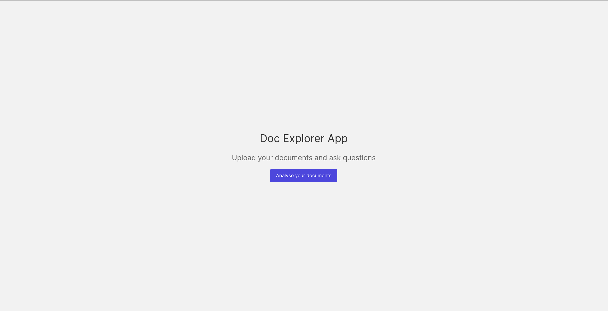

<div align="center">
    <h1 align="center">Doc Explorer</h1>
</div>
<div>
    <h3 align="center">Upload your documents and ask questions</h3>
</div>
<div align="center">
   
</div>

## Introduction

Doc Explorer allows you to upload your documents and ask question on these documents.

## Setup

1. Clone the repository

    ```bash
    git clone https://github.com/siddhantmahalle/doc-explorer.git
    ```

2. Go to doc-explorer directory

    ```bash
    cd doc-explorer
    ```

3. create a .env file and add the following variables

    ```bash
    OPENAI_API_KEY=
    PINECONE_API_KEY=
    PINECONE_ENVIRONMENT=
    PINECONE_INDEX_NAME=
    ````

4. Build the docker image

    ```bash
    docker build -t doc-explorer:v1 .
    ```

5. Start the docker using the docker-compose file

    ```bash
    docker compose up
    ```
   
6. The app will be running on
    
    ```bash
    http://localhost:3000
    ```


## How to use

- Upload your document (pdf, txt, pptx, word, markdown, LaTeX)
- The app will analyse your document
- You can ask your questions in the chat UI


    
